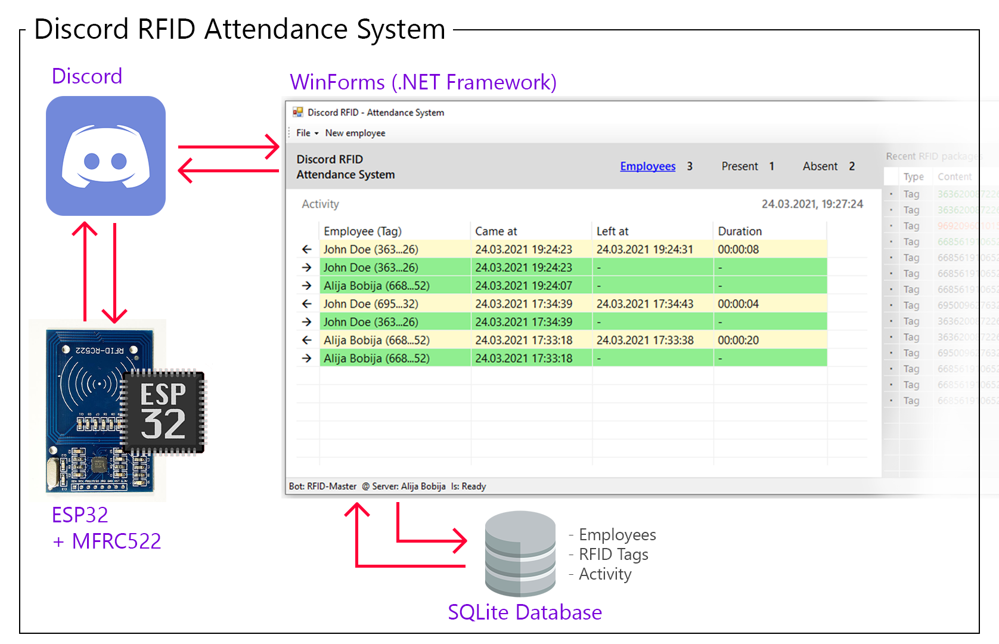

# discord-rfid
Discord RFID Attendance System realized with ESP32 (esp-idf) and C# (WinForms)

## Abstraction

## What is this?

This repository represent RFID Attendance System realized with using Discord as communication layer between [ESP32 (+MFRC522)](esp) as IoT device on one side, and [WinForms desktop application](DiscordRfId) as a server on the other side.

System is design in a way that there can be multiple devices, for example if company that uses this app is in need to install RFID devices on more than one entrance.

## How it works?

When new RFID tag is applied over the RFID scanner module ESP32 will immediately serialize it into appropriate package and push it to the Discord server into specific channel. When package arrives in channel, Discord will forward it to the WinForm application through the permanent WebSocket channel. WinForms application will than deserialize package and do validation (does received message represent package, does user who sends package has slave role, does received tag exists in local database etc...). If validation passed new activity of appropriate Employee will be stored into SQLite database.

Creation of required Discord channel, as well as roles for differentiate between slave (ESP32) and master (WinForm app) is done automatically (by user approvement) on first (WinForm) application startup. Only what needs to be manually done is to assign slave role to ESP32 bot in Discord server settings, once when WinForm application create roles (this can be as well automatically done but it's not implemented in current v1.0.0.0 version).

## Tool stack

- ESP32
    - [ESP-IDF](https://github.com/espressif/esp-idf) framework
    - [esp-discord](https://github.com/abobija/esp-discord) component
    - [esp-idf-rc522](https://github.com/abobija/esp-idf-rc522) component
    - [base64](https://github.com/abobija/cb64) library

- WinForms (.NET Framework)
    - [DiscordNET](https://github.com/discord-net/Discord.Net) discord bot
    - [SQLite](https://docs.microsoft.com/en-us/dotnet/standard/data/sqlite) database
    - [Serilog](https://serilog.net/) logging
    - [Json.NET](https://www.newtonsoft.com/json) serializer

## Author

GitHub: [abobija](https://github.com/abobija) 
Homepage: [abobija.com](https://abobija.com)

## License

[MIT](LICENSE)